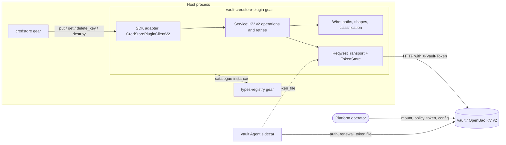
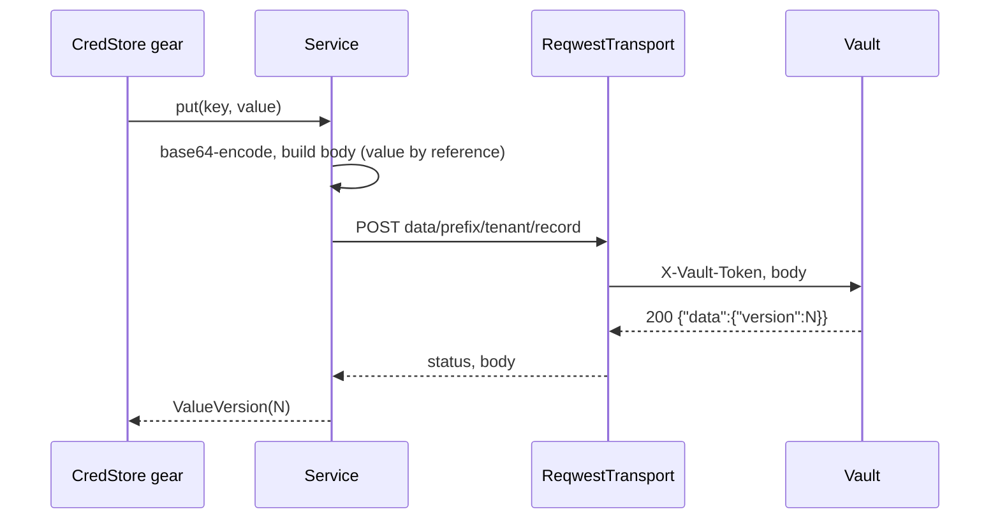
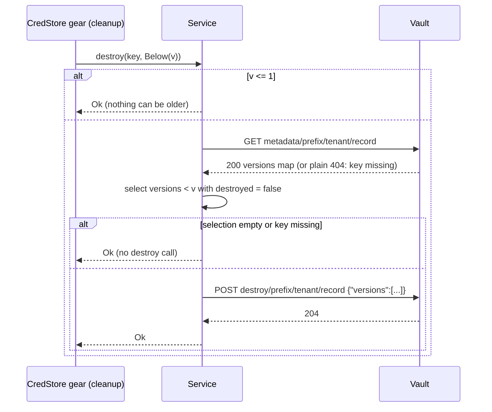

---
refs:
  - PRD.md
  - ../../../docs/DESIGN.md
  - ../../../docs/ADR/0006-cpt-cf-credstore-adr-immutable-value-versions.md
---

Created:  2026-10-03 by Constructor Tech
Updated:  2026-10-03 by Constructor Tech

# Technical Design — Vault CredStore Plugin

- [ ] `p3` - **ID**: `cpt-cf-credstore-vault-design-vault-credstore-plugin`

**Scope:** Architecture of the Vault CredStore plugin (crate `cf-gears-vault-credstore-plugin`), which lives alongside this document at `gears/credstore/plugins/vault-credstore-plugin`. The implementation is authoritative; this document describes what the code does, including the constants it uses. It also states the operator obligations (mount, ACL policy, token delivery) that the code relies on and does not check.

<!-- toc -->

- [1. Architecture Overview](#1-architecture-overview)
  - [1.1 Architectural Vision](#11-architectural-vision)
  - [1.2 Architecture Drivers](#12-architecture-drivers)
  - [1.3 Architecture Layers](#13-architecture-layers)
- [2. Principles & Constraints](#2-principles--constraints)
  - [2.1 Design Principles](#21-design-principles)
  - [2.2 Constraints](#22-constraints)
- [3. Technical Architecture](#3-technical-architecture)
  - [3.1 Domain Model](#31-domain-model)
  - [3.2 Component Model](#32-component-model)
  - [3.3 API Contracts](#33-api-contracts)
  - [3.4 Internal Dependencies](#34-internal-dependencies)
  - [3.5 External Dependencies](#35-external-dependencies)
  - [3.6 Interactions & Sequences](#36-interactions--sequences)
  - [3.7 Database schemas & tables](#37-database-schemas--tables)
- [4. Additional context](#4-additional-context)
  - [4.1 Security and Data Protection](#41-security-and-data-protection)
  - [4.2 Mount and Deployment Requirements](#42-mount-and-deployment-requirements)
  - [4.3 Failure Modes and Enablement Gates](#43-failure-modes-and-enablement-gates)
  - [4.4 Verification Architecture and Observability](#44-verification-architecture-and-observability)
- [5. Traceability](#5-traceability)
  - [5.1 Authoritative Contracts](#51-authoritative-contracts)
  - [5.2 Requirement Allocation](#52-requirement-allocation)

<!-- /toc -->

The adjacent [PRD](./PRD.md) is authoritative for WHAT, WHY, actors and acceptance criteria. The CredStore SDK (`plugin_api.rs`) and [ADR-0006](../../../docs/ADR/0006-cpt-cf-credstore-adr-immutable-value-versions.md) are authoritative for the backend contract; the CredStore [DESIGN §4.3](../../../docs/DESIGN.md) lists the obligations of a backend. This document defines how the plugin meets them on Vault KV v2.

## 1. Architecture Overview

### 1.1 Architectural Vision

The plugin is a thin, stateless adapter running as an in-process ToolKit gear (`vault-credstore-plugin`) next to the CredStore gear. It implements one ClientHub contract, `CredStorePluginClientV2`, registered **scoped** under its types-registry catalogue instance so that CredStore selects it by vendor and priority. It keeps no state beyond the cached token and talks to Vault over HTTP with a token: no login method, no renewal, no background task, no startup probe.

Every operation is one or two Vault KV v2 calls:

- `put` is one `POST` that creates a new version; Vault returns the version number, which is the `ValueVersion`.
- `get` is one `GET` of a named version.
- `delete_key` is one `DELETE` of the key's metadata, which removes all versions.
- `destroy(Exactly(v))` is one `POST` to the destroy endpoint; `destroy(Below(v))` first reads the key's metadata to learn which versions exist, then destroys those below `v`.

The plugin adds three things the contract leaves to the backend: **token authentication with rotation** (a rejected request re-reads the token source once and is retried once), **bounded retries** of the idempotent operations with exponential backoff (never of `put`), and a **precise classification of Vault's answers** into the SDK error taxonomy. The latter matters because Vault signals very different situations with the same status code: `404` means an absent key, a soft-deleted version, a destroyed version or a missing mount, and each of these maps differently (§3.3).

### 1.2 Architecture Drivers

| Driver | Design allocation |
|---|---|
| Exact bytes, durable versions (ADR-0006) | One KV v2 write per `put`, never overwritten, never `cas`; the value is stored base64-encoded in one field; the version is Vault's own number |
| Ordered versions with `destroy` | KV v2 numbers versions per key from 1, increasing; a destroyed number is never reissued (verified by the conformance suite) |
| Idempotent `delete_key` / `destroy` | A plain `404` and Vault's `204` for a missing key or version are success; `destroy(Below)` makes no call when nothing is left to destroy |
| Token rotation without restart | `TokenStore` caches the token; a `403` makes the transport re-read the source once and resend the request once if the token changed |
| No startup dependency on Vault | Config validation is static; the transport performs no I/O when built; a `token_file` is read on first use |
| Honest failure classes | Fixed mapping table (§3.3); a `403` is "service unavailable", a plain `404` on read is "no value", an explained `404` is an internal error |
| Secret non-disclosure | Redacted `VaultToken`, no `Debug` of secrets, bounded and scrubbed Vault error text, request and response bodies never logged |
| Layering (DE0301 / DE0308) | `domain` (service, wire logic, retry policy, transport port) imports no HTTP types; `infra` holds the `reqwest` adapter and the token source |

### 1.3 Architecture Layers

- [ ] `p3` - **ID**: `cpt-cf-credstore-vault-tech-inprocess-gear-stack`



| Layer | Responsibility |
|---|---|
| Gear wiring (`gear.rs`) | Config load and `${VAR}` expansion, types-registry publication, scoped ClientHub registration; builds the service through `factory.rs` |
| Construction (`factory.rs`) | The one place where a validated configuration becomes a `Service` over the `reqwest` transport; shared by the gear's `init` and by the public `client_from_config` (§3.3) |
| SDK adapter (`domain/client.rs`) | Implements `CredStorePluginClientV2` by delegating to the service; ignores the security context (correlation only) |
| Service (`domain/service.rs`) | Builds the KV v2 requests, runs the retry loop, orders the calls of `destroy(Below)`, logs |
| Wire logic (`domain/wire.rs`) | Pure: paths, JSON shapes, base64 value coding, status and body classification, error text scrubbing |
| Retry policy (`domain/retry.rs`) | Pure: attempt count, exponential backoff with cap and jitter |
| Transport port (`domain/transport.rs`) | `VaultTransport`: one request in, one response (status, body, `Retry-After`) or a coarse transport error out |
| Infrastructure (`infra/`) | `ReqwestTransport` (timeout, headers, the single 403 retry) and `TokenStore` (token sources and re-read) |

## 2. Principles & Constraints

### 2.1 Design Principles

#### One contract call, at most two Vault calls

- [ ] `p3` - **ID**: `cpt-cf-credstore-vault-principle-thin-adapter`

The plugin does not cache values, batch calls, list keys or keep any state of the store. The only state is the cached token. `destroy(Below)` is the one operation that needs two calls, because KV v2 has no "destroy everything below N" call.

#### A definite answer is never retried

- [ ] `p3` - **ID**: `cpt-cf-credstore-vault-principle-retry-transient-only`

Only failures that say nothing about the outcome of a read or an idempotent change (no response, timeout, `5xx`, `408`, `429`) are retried. Any other response, `4xx` included, is final. A `403` is handled once by the transport (token re-read) and then final. `put` is sent at most once, because after the request left the process its outcome can be ambiguous, and a second `put` would create a second version nobody references; the gear's write intent already covers the possibly stored first one.

#### No silent success

- [ ] `p3` - **ID**: `cpt-cf-credstore-vault-principle-no-silent-success`

A condition that looks like "nothing to do" but is in fact a misconfiguration is an error: a `404` that explains itself (`no handler for route`, a missing mount) is not "key absent", so a wrong mount name can never make `delete_key` report success, `get` report "no value" or `destroy` report "nothing left".

#### Secrets never leave the type that holds them

- [ ] `p3` - **ID**: `cpt-cf-credstore-vault-principle-secret-containment`

The token lives in `VaultToken` (redacted `Debug`) and `Arc<str>` in the token store, and in a header value marked sensitive; secret bytes live in `SecretValue` and in the request body of one call. Neither is formatted into a message. The service sends the encoded value by reference and scrubs it from any Vault error text.

#### Operator obligations are documented, not checked

- [ ] `p3` - **ID**: `cpt-cf-credstore-vault-principle-documented-obligations`

The mount settings (`delete_version_after`, `cas_required`, `max_versions`), the ACL policy and the token delivery are the operator's. The plugin does not read `{mount}/config`, does not probe health at start and does not verify the token's capabilities. §4.2 and §4.3 state what happens when an obligation is violated.

### 2.2 Constraints

#### No startup or background activity

- [ ] `p3` - **ID**: `cpt-cf-credstore-vault-constraint-no-startup-io`

`Gear::init` loads and validates the configuration, builds the transport (which resolves an inline token and a `token_env` variable, and nothing else) and registers in the types-registry. It never contacts Vault. A `token_file` is read when the first request needs it. No task is spawned, no timer runs.

#### Token only, TLS as the HTTP client defaults

- [ ] `p3` - **ID**: `cpt-cf-credstore-vault-constraint-token-only`

A Vault token is the only credential. There are no TLS settings: `https://` addresses use the HTTP client's default trust roots and verification. Deployments that need a private CA, a client certificate or another login method put an intermediary in front (a Vault Agent, a proxy) or extend the plugin.

#### Idempotent operations only are retried, within `timeout_secs` per request

- [ ] `p3` - **ID**: `cpt-cf-credstore-vault-constraint-bounded-time`

Each Vault request is bounded by `timeout_secs`. The worst case of one contract call is the number of Vault calls it makes times `retry.max_attempts` times `timeout_secs`, plus the backoff pauses (§3.6). The CredStore gear adds no timeout of its own to backend I/O.

#### One key per record, versions never overwritten

- [ ] `p3` - **ID**: `cpt-cf-credstore-vault-constraint-one-key-per-record`

All versions of a record live under one KV path `{mount}/data/{path_prefix}/{tenant_id}/{record_id}`. `delete_key` removes the key, after which Vault restarts the version numbering of that path at 1. This is safe because the gear never reuses a record id (ADR-0006), and the conformance suite does not cover a `put` after `delete_key` on the same key.

## 3. Technical Architecture

### 3.1 Domain Model

#### Store key and KV path

- [ ] `p3` - **ID**: `cpt-cf-credstore-vault-entity-store-key`

The gear's `StoreKey { tenant_id, record_id }` (two UUIDs) maps to the path segment `{path_prefix}/{tenant_id}/{record_id}` under the mount. Three endpoints of the KV v2 engine address it:

| Endpoint | Path | Used by |
|---|---|---|
| data | `{mount}/data/{path_prefix}/{tenant_id}/{record_id}` | `put`, `get` |
| metadata | `{mount}/metadata/{path_prefix}/{tenant_id}/{record_id}` | `delete_key`, the version listing of `destroy(Below)` |
| destroy | `{mount}/destroy/{path_prefix}/{tenant_id}/{record_id}` | `destroy` |

All are called as `{address}/v1/{path}`. The plugin never interprets `tenant_id`; it is opaque path material.

#### Value and version

- [ ] `p3` - **ID**: `cpt-cf-credstore-vault-entity-value-version`

A value is stored as `{"data": {"value": "<base64 of the bytes>"}}`: base64 (standard alphabet, with padding) keeps arbitrary bytes, including NUL and invalid UTF-8, inside a JSON document. A `ValueVersion` is the decimal string of Vault's version number. Versions start at 1; `0` is never produced. The plugin accepts back only decimal numbers (anything else is an internal error: the gear passes back what `put` returned).

### 3.2 Component Model

#### Vault CredStore plugin

- [ ] `p3` - **ID**: `cpt-cf-credstore-vault-component-vault-credstore-plugin`

| Component | Notes |
|---|---|
| `VaultCredStorePlugin` (gear) | Registered with the ToolKit macro, `deps = [types_registry]`. Publishes `PluginV1<CredStorePluginSpecV1>` with instance segment `cf.core._.vault_credstore.v1`, the configured vendor (default `openbao`) and priority (default 100), then registers the scoped client. |
| `Service` | Holds `Arc<dyn VaultTransport>`, address, mount, prefix and the `RetryPolicy`. Inherent methods `put_value`, `get_value`, `delete_key_value`, `destroy_value`; the trait implementation in `client.rs` forwards to them. `supports_destroy()` is `true`. |
| `wire` | Path builders, request bodies (`PutRequestBody`, `DestroyRequestBody`), response parsing, `classify_*` functions, `map_error_status`, `error_text`. No I/O. |
| `RetryPolicy` | `max_attempts`, base delay; `backoff(n)` doubles from the base and never exceeds 2 s; `jittered_backoff(n)` picks a random point in its upper half. |
| `VaultTransport` / `ReqwestTransport` | The port and its adapter. The adapter owns the HTTP client with `timeout_secs`, sends `X-Vault-Token` (marked sensitive) and `X-Vault-Namespace`, parses `Retry-After` (seconds only, capped at 300 s) and applies the single 403 retry. A body that cannot be read is a transport failure, not an empty response. |
| `TokenStore` / `TokenSource` | `Inline`, `Env` and `File` sources. Inline and environment tokens are resolved at construction; a file on first use. Tokens are trimmed and must be non-empty visible ASCII. |
| `VaultCredStorePluginConfig` | `deny_unknown_fields`; `validate()` enforces §3.3's rules; `${VAR}` expansion for `token` and `token_file`. |
| `client_from_config` | Public constructor re-exported at the crate root: `fn client_from_config(&VaultCredStorePluginConfig) -> anyhow::Result<Arc<dyn CredStorePluginClientV2>>`. Validates, builds the transport and the `Service`, performs no I/O. See §3.3 *Constructing the client outside the gear*. |

### 3.3 API Contracts

The plugin exposes no HTTP API. Its contracts are the SDK trait it implements, the Vault HTTP API it calls, and its configuration.

#### Operation mapping

All calls carry `X-Vault-Token` (and `X-Vault-Namespace` when configured). "Transient" means: no response, timeout, `5xx`, `408`, `429`.

| Operation | HTTP call | Success | `404` | Other errors |
|---|---|---|---|---|
| `put(key, value)` | `POST data/...` with `{"data":{"value":"<base64>"}}` (no `cas`) | `200` with `data.version` -> that version | Explained `404` (missing mount) -> `Internal`; a plain `404` on a write does not occur | Not retried. Transient -> `ServiceUnavailable`; `403` -> `ServiceUnavailable`; `400` -> `Internal` with Vault's text; anything else -> `Internal` |
| `get(key, version)` | `GET data/...?version=N` (never sent for `N = 0`) | `200` with a value -> bytes | Plain `404` (absent, soft-deleted, destroyed, evicted, key missing) -> `None`; explained `404` -> `Internal` | Retried on transient. `403` -> `ServiceUnavailable`; an entry with no string `value` or invalid base64 -> `Internal` (permanent); unexpected shape -> `Internal` |
| `delete_key(key)` | `DELETE metadata/...` | `204` / `2xx` -> `Ok` | Plain `404` -> `Ok`; explained `404` -> `Internal` | Retried on transient; `403` -> `ServiceUnavailable`; others -> `Internal` |
| `destroy(key, Exactly(v))` | `POST destroy/...` with `{"versions":[v]}` (no call for `v = 0`) | `204` -> `Ok` | Plain `404` -> `Ok`; explained `404` -> `Internal` | As `delete_key` |
| `destroy(key, Below(v))` | `GET metadata/...`, then `POST destroy/...` with every version `< v` that has `destroyed = false` | `Ok` | Plain `404` on the metadata read (no such key) -> `Ok`, no destroy call; empty selection -> `Ok`, no destroy call; `v <= 1` -> `Ok` without any call | Each of the two calls retried on transient; `403` -> `ServiceUnavailable`; others -> `Internal` |
| `supports_destroy()` | none | `true` | | |

A soft-deleted version has `destroyed = false` and a `deletion_time`: it is included in a `Below` selection, so that a cleanup turns it into a destroyed one.

#### Error mapping

| Vault answer or local failure | `CredStoreError` | Retried (idempotent calls) | Notes |
|---|---|---|---|
| No response: connect failure, timeout, broken body | `ServiceUnavailable` | yes | The message holds the coarse kind only, never the request URL |
| The token cannot be loaded (missing file, unset variable, empty) | `ServiceUnavailable` | yes | Recovers when the file appears |
| `5xx`, `408`, `429` | `ServiceUnavailable` | yes | `retry_after` set from a `Retry-After` header in seconds; text of Vault's error included (for example `Vault is sealed`) |
| `403` after the token re-read | `ServiceUnavailable` | no | Message names the `403`, not the token. Not `AccessDenied`: the gear turns a plugin's `AccessDenied` into "not found" on reads, which would hide a revoked or under-privileged token |
| `400` | `Internal` | no | Message carries Vault's error text, flattened, 200 characters at most, with the encoded value scrubbed |
| Any other `4xx` / `3xx` | `Internal` | no | Status and text |
| Explained `404` (`no handler for route`) | `Internal` | no | A missing mount is a configuration error |
| Response that is not the expected JSON shape | `Internal` | no | The body is never echoed |
| Entry present but not a value this plugin wrote | `Internal` | no | Permanent: retrying does not help; the record must be rewritten; the gear answers 500 |
| `version` that is not a number | `Internal` | no | The gear passes back only what `put` returned |

#### Vault answers the plugin relies on

Observed against `hashicorp/vault` 2.1.1 and 1.21 (dev server) and pinned by the integration tests (`tests/vault_behaviour.rs`); OpenBao shares the KV v2 implementation.

| Situation | Vault's answer |
|---|---|
| `POST data/...` | `200`, body `{"data":{"version":N,"created_time":...,"deletion_time":"","destroyed":false,"custom_metadata":null}}` |
| `GET data/...?version=N`, live version | `200`, `{"data":{"data":{"value":"..."},"metadata":{"version":N,"deletion_time":"","destroyed":false,...}}}` |
| Version never written, key never written, version evicted by `max_versions` | `404`, `{"errors":[]}` |
| Soft-deleted version (by `delete`, or by `delete_version_after`) | `404`, `{"data":{"data":null,"metadata":{"deletion_time":"<time>","destroyed":false,"version":N,...}}}` (no `errors`) |
| Destroyed version | `404`, `{"data":{"data":null,"metadata":{"deletion_time":"","destroyed":true,"version":N,...}}}` (no `errors`) |
| `GET data/...?version=0` | `200` with the **latest** version (not "version 0"): the plugin never sends it |
| Path under a mount that does not exist | `404`, `{"errors":["no handler for route \"...\". route entry not found."]}` |
| `DELETE metadata/...`, `POST destroy/...` on a missing key or version | `204` |
| `GET metadata/...` | `200`, `{"data":{"current_version":N,"oldest_version":M,"max_versions":K,"versions":{"<n>":{"destroyed":false,"deletion_time":"",...}}}}`; `404` `{"errors":[]}` for a missing key |
| Missing or revoked token, or a policy that does not cover the path | `403`, `{"errors":["permission denied"]}` (plus `invalid token` for an unknown token) |
| Mount with `cas_required = true`, write without `cas` | `400`, `{"errors":["check-and-set parameter required for this call"]}` |
| Sealed server | `503`, `{"errors":["Vault is sealed"]}` |
| `POST destroy/...` with an empty version list | `400`, `{"errors":["no version number provided"]}` (the plugin never sends one) |
| After `DELETE metadata/...`, a new `POST data/...` | Numbering restarts at version 1 |

Retention: the effective number of versions Vault keeps per key is the larger of the mount's and the key's own `max_versions` (the key's value can raise the limit but not lower it below the mount's); both `0`/unset means 10. Versions beyond it are removed oldest first and then answer as "never written".

#### Constructing the client outside the gear

```rust
pub fn client_from_config(
    cfg: &VaultCredStorePluginConfig,
) -> anyhow::Result<Arc<dyn CredStorePluginClientV2>>
```

For a process that has no ClientHub and does not run the gear (an operator's value-migration binary that writes into this plugin; see the CredStore value-migration guide, Part 2), the crate root re-exports `client_from_config`. It is the construction the gear's `init` performs, factored into `factory.rs` so the two cannot drift apart:

1. `cfg.validate()` (the rules of the configuration reference below), failing with an error that names the key and never contains the token;
2. `ReqwestTransport::from_config`: resolves an inline or `token_env` token, builds the HTTP client with `timeout_secs`; a `token_file` is read on the first request;
3. `Service::new` over that transport with the address, mount, prefix and retry policy of `cfg`, returned as `Arc<dyn CredStorePluginClientV2>`.

It performs no network call, does not publish the catalogue instance and does not touch the ClientHub. `${VAR}` placeholders are not expanded (the gear expands them while loading its `config` block); the caller passes resolved values. The construction lives at the crate root, outside `domain/` and `infra/`, so the layering rule of §1.2 is unchanged: `domain` still imports no HTTP type and `infra` is only reached from the wiring. The caller must pass the same `address`, `mount`, `path_prefix`, `namespace` and token as the running gear, otherwise the versions it writes are not the ones the gear reads.

#### Configuration reference

The plugin's configuration is the `config` block of the `vault-credstore-plugin` gear. Unknown keys are rejected.

```yaml
gears:
  vault-credstore-plugin:
    config:
      vendor: "openbao"
      priority: 100
      address: "https://vault.internal:8200"
      token_file: "/vault/secrets/token"     # exactly one of token / token_file / token_env
      mount: "secret"
      path_prefix: "credstore"
      namespace: null
      timeout_secs: 5
      retry:
        max_attempts: 3
        base_delay_ms: 100
```

| Key | Type | Default | Meaning and validation |
|---|---|---|---|
| `vendor` | string | `openbao` | Vendor of the catalogue instance; CredStore's `vendor` setting must match |
| `priority` | integer | `100` | Priority of the catalogue instance (lower wins) |
| `address` | string | `http://127.0.0.1:8200` | Base URL of the server; must start with `http://` or `https://`; a trailing slash is tolerated |
| `token` | string | none | Inline token; `${VAR}` is expanded from the process environment; not empty |
| `token_file` | string | none | Path of a file holding the token (trimmed); `${VAR}` expanded; read on first use and after a `403` |
| `token_env` | string | none | Name of an environment variable holding the token; read at startup |
| `mount` | string | `secret` | KV v2 mount path; non-empty, no leading or trailing `/`, no empty segment, no whitespace, `?` or `#` |
| `path_prefix` | string | `credstore` | Prefix under the mount; same rules as `mount` |
| `namespace` | string | none | Sent as `X-Vault-Namespace` when set; not blank |
| `timeout_secs` | integer | `5` | Timeout of every Vault request; greater than 0 |
| `retry.max_attempts` | integer | `3` | Attempts per Vault call, the first included; `1` disables retries; 1 to 10 |
| `retry.base_delay_ms` | integer | `100` | Pause before the second attempt; doubles per attempt, capped at 2000 ms; 1 to 2000 |

Exactly one of `token`, `token_file`, `token_env` must be set; none or several is an error naming the keys. A `token_env` variable that is unset or empty, or an inline token that is empty or contains characters not allowed in a header, fails startup; an unreadable `token_file` does not (§2.2).

### 3.4 Internal Dependencies

| Internal dependency | Purpose |
|---|---|
| `cf-gears-credstore-sdk` | `CredStorePluginClientV2`, `StoreKey`, `ValueVersion`, `SecretValue`, `CredStoreError`; the `conformance` feature in tests |
| `cf-gears-types-registry-sdk` and the types-registry gear | `PluginV1` catalogue publication (hard init prerequisite) |
| ToolKit and ClientHub | Gear lifecycle, `${VAR}` expansion, scoped client registration |

### 3.5 External Dependencies

| Dependency | Contract and failure boundary |
|---|---|
| CredStore gear | The only caller; `delete_key` / `destroy` called by the gear right after the commit or when it heals a record on access, possibly again for the same version or key (idempotent); `put` and `get` on request paths |
| Vault or OpenBao | KV v2 HTTP API at `address`, per-request timeout `timeout_secs`; unavailability is `ServiceUnavailable` and recovers without restart |
| Vault Agent sidecar (optional) | Keeps the token file fresh; the plugin only reads the file |
| types-registry | Catalogue instance publication at init |

### 3.6 Interactions & Sequences

#### Write a value

**ID**: `cpt-cf-credstore-vault-seq-put`

**Use cases**: `cpt-cf-credstore-vault-usecase-write-read` — **Actors**: `cpt-cf-credstore-vault-actor-credstore-gear`, `cpt-cf-credstore-vault-actor-vault`



One attempt. A transport failure or a `5xx` after the request was sent is `ServiceUnavailable`; whether Vault stored the version is unknown, which the gear's write intent covers. A `403` goes through the token re-read of the transport (below) before it surfaces; a `403` proves nothing was executed, so that resend cannot duplicate a write.

#### Read a version

**ID**: `cpt-cf-credstore-vault-seq-get`

`get` sends `GET data/...?version=N` and classifies: `200` -> decode `data.data.value`; plain `404` -> `None`; everything else per the error table. Transient failures are retried by the service loop below. A version of `0` returns `None` without a request.

#### Destroy versions below a cut

**ID**: `cpt-cf-credstore-vault-seq-destroy-below`

**Use cases**: `cpt-cf-credstore-vault-usecase-cleanup`



Each of the two calls has its own retry budget. A concurrent `put` that lands between them creates a version above the cut and is not affected.

#### Retry loop

**ID**: `cpt-cf-credstore-vault-seq-retries`

For `get`, `delete_key` and `destroy`, `Service::call` sends the request and, on a transient failure while attempts remain, sleeps `jittered_backoff(n)` and sends it again:

| After failed attempt | Pause (upper bound, before jitter) |
|---|---|
| 1 | `base_delay_ms` (100 ms) |
| 2 | `2 * base_delay_ms` (200 ms) |
| n | `base_delay_ms * 2^(n-1)`, never more than 2000 ms |

The pause actually taken is uniformly random in the upper half of that bound. When attempts are used up the last failure is returned (with `Retry-After` when Vault sent one). With the defaults the worst case of one call is `3 * 5 s + 0.3 s`; `destroy(Below)` makes two calls. `put` uses a policy of one attempt.

#### Token rotation on 403

**ID**: `cpt-cf-credstore-vault-seq-token-rotation`

**Use cases**: `cpt-cf-credstore-vault-usecase-token-rotation`

```mermaid
sequenceDiagram
    participant S as Service
    participant T as ReqwestTransport
    participant K as TokenStore
    participant F as token file
    participant V as Vault
    S->>T: send(request)
    T->>K: current()
    K-->>T: token A (cached; read from the file on first use)
    T->>V: request with A
    V-->>T: 403
    T->>K: refreshed_after_rejection(A)
    K->>F: read
    F-->>K: token B
    alt B differs from A
        K-->>T: B (cache updated)
        T->>V: same request with B
        V-->>T: response
    else same token, unreadable or inline source
        K-->>T: nothing new
    end
    T-->>S: the response (a second 403 is final)
```

The re-read happens at most once per request and the resend at most once. An inline token cannot change, so a `403` is returned at once; an environment variable is re-read but cannot change in a running process. Concurrent requests that were rejected at the same time each re-read the small file independently; the cache converges on the latest content.

### 3.7 Database schemas & tables

None. The plugin owns no persistent state; the cached token is in memory only.

## 4. Additional context

### 4.1 Security and Data Protection

#### Trust boundaries

| Boundary | Control |
|---|---|
| CredStore gear to plugin | In-process ClientHub; the gear authorizes; the plugin ignores the security context (correlation only) |
| Plugin to Vault | The address is configuration, the path is built from configuration and two UUIDs, never from caller strings; `X-Vault-Token` is a sensitive header; `https://` is the operator's choice of address |
| Token at rest | Held in memory in `VaultToken` / `Arc<str>`; a `token_file` is the operator's file (restrict it to the service account) |
| Secret bytes | Exist as `SecretValue`, as base64 in the request body of one call, and in a response body parsed immediately; never formatted into messages or logs |
| Plugin to logs | `tracing` events carry counts, statuses and token source names; tenant and record ids and versions only at debug level; never tokens, bodies or values |
| Vault's error text | Flattened, cut to 200 characters, and the encoded value of the write in flight is replaced before the text enters an error |

#### Minimal ACL policy

The token needs exactly the capabilities below. Replace `secret` with the configured `mount` and `credstore` with the configured `path_prefix`:

```hcl
# Write (create the first version, add further ones) and read versions.
path "secret/data/credstore/*" {
  capabilities = ["create", "update", "read"]
}

# Read the version list (destroy of versions below a cut); remove a key.
path "secret/metadata/credstore/*" {
  capabilities = ["read", "delete"]
}

# Destroy versions.
path "secret/destroy/credstore/*" {
  capabilities = ["update"]
}
```

The policy grants no `list`, no `delete` on `data` (soft delete), no `undelete` and no access outside the prefix; the integration tests run the whole conformance suite with a token that holds only this policy and check that other prefixes and mounts are denied. Create the token without the `default` policy if the deployment does not need it (`no_default_policy`), and prefer a short-lived or periodic token renewed by Vault Agent.

#### Token file permissions

When `token_file` is used, the file is readable by the plugin's service account only (mode `0640` or tighter, owned by the process or its group). The plugin reads it with ordinary file I/O and trims surrounding whitespace.

### 4.2 Mount and Deployment Requirements

#### Mount settings

The plugin needs a **KV v2** mount (`vault secrets enable -path=secret -version=2 kv`, or the mount's `options.version = 2`). The operator **MUST** set:

| Setting | Required value | If violated |
|---|---|---|
| `delete_version_after` | `0s` (disabled) | Versions are soft-deleted after the interval; `get` then answers "no value" for a version a record still points at, and the record answers an internal error (500) until rewritten |
| `cas_required` | `false` | Every `put` is refused by Vault with `400 check-and-set parameter required for this call`; the plugin surfaces it as an internal error |
| `max_versions` | Larger than the number of versions one key can hold at once (see below) | Vault drops the oldest versions of a key beyond the limit |

```bash
vault write secret/config max_versions=20 delete_version_after=0s cas_required=false
```

**Retention.** Vault keeps **10 versions per key by default**; `max_versions = 0` or unset also means 10, not unlimited. The effective limit of a key is the larger of the mount's `max_versions` and the key's own (`vault kv metadata put -max-versions=N`); a key's own value can raise the limit above the mount's but not lower it. Set a larger `max_versions` on the mount (or per key) if you need more.

What exceeding it means for CredStore: a key normally holds one or two versions, because the gear destroys superseded versions right after each commit. If more versions than the limit pile up above the version a record points at (orphans of failed or ambiguous writes and the versions of writers that lost the CAS, destroyed or not, since destroyed versions still count; versions below the pointer are evicted first and are harmless), Vault removes the oldest ones, which may include the referenced version. The plugin then answers "no value" for it, the gear finds that the pointer did not move, and the record answers an internal error (500) until it is rewritten (CredStore DESIGN §4.6). The plugin does not check these settings, at startup or later.

#### Token delivery: the Vault Agent sidecar pattern (Kubernetes)

The recommended deployment on Kubernetes keeps the Vault login out of the plugin: a Vault Agent sidecar authenticates with the pod's service account through the Kubernetes auth method, renews the token and writes it to a file in a shared volume; the plugin is configured with `token_file`.

1. In Vault: enable the Kubernetes auth method, create the policy of §4.1 (named, for example, `credstore`) and a role that binds the gear's service account and namespace to it, with a token TTL the agent can renew:

   ```bash
   vault write auth/kubernetes/role/credstore \
     bound_service_account_names=credstore \
     bound_service_account_namespaces=platform \
     token_policies=credstore token_ttl=1h token_max_ttl=24h
   ```

2. In the pod: with the Vault Agent Injector, annotations make the injector add the sidecar and place its token at `/vault/secrets/token`:

   ```yaml
   metadata:
     annotations:
       vault.hashicorp.com/agent-inject: "true"
       vault.hashicorp.com/role: "credstore"
       vault.hashicorp.com/agent-inject-token: "true"
   ```

   Without the injector, run `vault agent` as a sidecar with an `auto_auth` block (`method "kubernetes"` and a `sink "file"` writing to the shared volume) and mount that volume read-only in the gear's container.

3. In the plugin:

   ```yaml
   gears:
     vault-credstore-plugin:
       config:
         address: "https://vault.platform.svc:8200"
         token_file: "/vault/secrets/token"
   ```

Behaviour at the edges: the file may not exist when the host starts (the sidecar is still logging in); the plugin starts anyway and its calls answer "service unavailable" until the file appears. When the agent re-authenticates and rewrites the file, the first request that Vault rejects with `403` re-reads it and succeeds on its single resend. A token that Vault revokes and that the agent has not yet replaced makes calls answer "service unavailable" until the file changes; no restart is needed.

Other deployments follow the same shape: any process that keeps a valid token in a file works as the sidecar; a long-lived token can be given as `token: "${VAULT_TOKEN}"` or `token_env: "VAULT_TOKEN"` when rotation is handled by redeploying.

### 4.3 Failure Modes and Enablement Gates

| Condition | What the plugin does | Operator action |
|---|---|---|
| Vault unreachable, timeouts, `5xx`, `429` | Idempotent calls retried within their budget, then `ServiceUnavailable`; `put` fails after one attempt | Restore Vault; the gear keeps cleanup debts and retries those of a live record on a later access (a deleted record's failed purge waits for a possible external job) |
| Vault sealed (`503`) | As above; the message includes `Vault is sealed` | Unseal |
| Token revoked, expired, or policy too narrow (`403`) | Token source re-read once; if unchanged or still rejected, `ServiceUnavailable` with a `403` message and a `warn` log naming the token source, never the token | Renew the token or fix the policy; a changed `token_file` is picked up without restart |
| `token_file` missing, empty or malformed | `ServiceUnavailable` for the calls that need a token; startup is not affected | Provide the file |
| `token_env` unset or empty, inline token empty or malformed | Startup fails with the key named | Fix the configuration |
| Mount does not exist or is misspelled | `Internal` for every operation (`no handler for route` text); `delete_key` does not report success | Fix `mount`, or enable the mount |
| Mount is not KV v2 | Reads and writes hit different paths than expected and fail or return unexpected shapes (`Internal`) | Use a KV v2 mount |
| `cas_required = true` | Every `put` fails with `Internal` carrying Vault's `check-and-set` text | Set `cas_required = false` |
| `delete_version_after` not `0s` | Versions disappear by age; affected records answer an internal error (500) | Set `0s`; rewrite affected records |
| More versions than the retention limit | The oldest are evicted; the referenced one may be among them (500) | Raise `max_versions`; rewrite affected records |
| Entry written by something else | `Internal` for that version (the gear answers 500) | Keep the prefix exclusive to CredStore |
| Response not valid JSON or not the KV v2 shape | `Internal` | Check for a proxy between the plugin and Vault |
| `put` times out after the request was sent | `ServiceUnavailable`; a version may exist | None: the gear's write intent tracks it and the record's next write or delete removes it |
| Wrong or not permitted `namespace` | Vault answers with an error status; the plugin reports it by the table of §3.3 (`Internal` for an explained `404`, `ServiceUnavailable` for `403`) | Fix `namespace` or the token's access to it |

Enablement gates before production use:

| Gate | Required resolution |
|---|---|
| Mount | KV v2 with `delete_version_after = 0s`, `cas_required = false` and a `max_versions` sized for the failure profile (default 10) |
| Policy | The minimal policy of §4.1, nothing wider; token without the default policy where possible |
| Token delivery | A sidecar writing `token_file`, or a deliberately long-lived `token` / `token_env` with a rotation procedure |
| Transport security | An `https://` address and the platform's trust roots, or an intermediary that provides TLS |
| Vault availability | Highly available Vault behind one address; Vault's own backup and unseal procedures |
| Qualification | The manual integration run of [TESTING.md](./TESTING.md) on the Vault version in use |

### 4.4 Verification Architecture and Observability

| Level | Purpose |
|---|---|
| Unit (in-crate) | Config parsing and validation; wire logic and the error mapping table; retry policy and backoff; service behaviour through a scripted fake transport (retry counts, `put` never retried, `destroy(Below)` selection) and an HTTP mock server (headers, bodies, `Retry-After`); the transport's 403 re-read; token sources |
| SDK conformance | `credstore_sdk::conformance` against a real `hashicorp/vault` with a minimal-policy token (manual, Docker) |
| Vault behaviour | Soft-deleted, destroyed, evicted and absent version shapes, `version=0`, foreign entries, `destroy(Below)` over many versions, token-file rotation, a missing mount, a sealed server, the policy's scope (manual, Docker) |

[TESTING.md](./TESTING.md) lists the tests and the commands.

Observability: the plugin emits no metrics; the CredStore gear records outcome and latency of every plugin call (`PluginGet`, `PluginDestroy`, ...). Logs use `tracing`:

| Level | Event |
|---|---|
| `info` | Startup: vendor, priority, address, mount, prefix, token source name, retry attempts; a token source that holds a new token after a `403` |
| `warn` | A call given up after its attempts; Vault answered `403` after the re-read; a token source that could not be read; a stored entry that is not a readable value |
| `debug` | Each operation with tenant id, record id and version; each transient failure and retry |

## 5. Traceability

### 5.1 Authoritative Contracts

- [Adjacent PRD](./PRD.md)
- [CredStore DESIGN](../../../docs/DESIGN.md) (§4.3 backend obligations) and [CredStore PRD](../../../docs/PRD.md)
- [ADR-0006: immutable value versions](../../../docs/ADR/0006-cpt-cf-credstore-adr-immutable-value-versions.md)
- [`plugin_api.rs`](../../../credstore-sdk/src/plugin_api.rs) and [`conformance.rs`](../../../credstore-sdk/src/conformance.rs)
- Implementation: crate `cf-gears-vault-credstore-plugin` (this directory)

### 5.2 Requirement Allocation

| PRD requirement IDs | Design sections |
|---|---|
| `cpt-cf-credstore-vault-fr-put`, `cpt-cf-credstore-vault-fr-get`, `cpt-cf-credstore-vault-fr-delete-key`, `cpt-cf-credstore-vault-fr-destroy`, `cpt-cf-credstore-vault-interface-plugin-client` | §§1.1, 3.1, 3.3, 3.6 |
| `cpt-cf-credstore-vault-fr-token-auth` | §§2.2, 3.3, 3.6, 4.1, 4.2 |
| `cpt-cf-credstore-vault-fr-retries`, `cpt-cf-credstore-vault-nfr-bounded-latency` | §§2.1, 2.2, 3.6 |
| `cpt-cf-credstore-vault-fr-failure-classification` | §§2.1, 3.3, 4.3 |
| `cpt-cf-credstore-vault-fr-config`, `cpt-cf-credstore-vault-interface-config` | §§2.2, 3.3 |
| `cpt-cf-credstore-vault-fr-selection` | §§3.2, 3.5 |
| `cpt-cf-credstore-vault-nfr-secret-nondisclosure` | §§2.1, 4.1 |
| `cpt-cf-credstore-vault-nfr-conformance`, `cpt-cf-credstore-vault-contract-vault-kv2` | §§3.3, 4.4 |
| `cpt-cf-credstore-vault-nfr-recovery` | §§3.6, 4.2, 4.3 |
