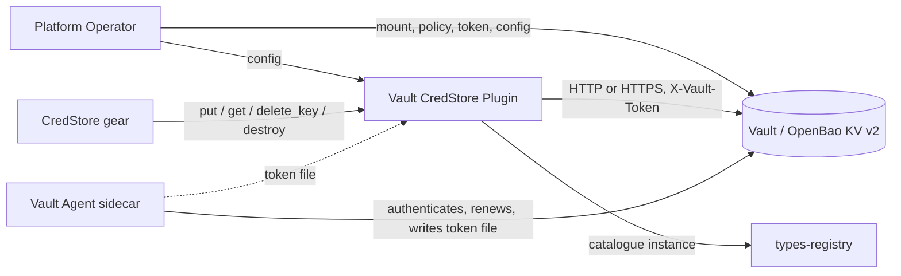

Created:  2026-10-03 by Constructor Tech
Updated:  2026-10-03 by Constructor Tech

# PRD — Vault CredStore Plugin

<!-- toc -->

- [1. Overview](#1-overview)
  - [1.1 Purpose](#11-purpose)
  - [1.2 Background / Problem Statement](#12-background--problem-statement)
  - [1.3 Goals (Business Outcomes)](#13-goals-business-outcomes)
  - [1.4 Glossary](#14-glossary)
- [2. Actors](#2-actors)
  - [2.1 Human Actors](#21-human-actors)
  - [2.2 System Actors](#22-system-actors)
- [3. Operational Concept & Environment](#3-operational-concept--environment)
  - [3.1 Gear-Specific Environment Constraints](#31-gear-specific-environment-constraints)
- [4. Scope](#4-scope)
  - [4.1 In Scope](#41-in-scope)
  - [4.2 Out of Scope](#42-out-of-scope)
- [5. Functional Requirements](#5-functional-requirements)
  - [5.1 Backend Contract](#51-backend-contract)
  - [5.2 Authentication](#52-authentication)
  - [5.3 Reliability and Failure Classification](#53-reliability-and-failure-classification)
  - [5.4 Configuration and Selection](#54-configuration-and-selection)
- [6. Non-Functional Requirements](#6-non-functional-requirements)
  - [6.1 Gear-Specific NFRs](#61-gear-specific-nfrs)
  - [6.2 NFR Exclusions](#62-nfr-exclusions)
- [7. Public Library Interfaces](#7-public-library-interfaces)
  - [7.1 Public API Surface](#71-public-api-surface)
  - [7.2 External Integration Contracts](#72-external-integration-contracts)
- [8. Use Cases](#8-use-cases)
- [9. Acceptance Criteria](#9-acceptance-criteria)
- [10. Dependencies](#10-dependencies)
- [11. Assumptions](#11-assumptions)
- [12. Risks](#12-risks)
- [13. Open Questions](#13-open-questions)
- [14. Traceability](#14-traceability)

<!-- /toc -->

## 1. Overview

### 1.1 Purpose

The Vault CredStore Plugin (crate `cf-gears-vault-credstore-plugin`) is a value-store backend for the CredStore gear. It implements the `CredStorePluginClientV2` contract on top of the KV v2 secrets engine of HashiCorp Vault or OpenBao, so that the secret values of the platform live in a dedicated, audited secret store while all metadata, hierarchy and authorization stay in the CredStore gear.

The plugin runs as a Gear in the host process next to CredStore. It exposes no public REST API, makes no authorization decision and keeps no state of its own: it translates five backend operations (`put`, `get`, `delete_key`, `destroy`, and the capability declaration) into Vault HTTP calls and classifies the answers into the SDK's error taxonomy.

### 1.2 Background / Problem Statement

CredStore stores secret values through a versioned key-value contract ([ADR-0006](../../../docs/ADR/0006-cpt-cf-credstore-adr-immutable-value-versions.md)): every write creates a new immutable version under the record's key, the gear keeps the version it wants in its own database, and superseded versions are removed by the gear from recorded cleanup debts, right after the commit or when it heals a live record on a later access. A production deployment needs a real secret store behind that contract. The in-memory `static-credstore-plugin` loses its content on restart and is meant for development and tests.

Vault and OpenBao KV v2 already provide what the contract asks for: server-assigned, ordered, immutable versions per key, destruction of individual versions and removal of a whole key. The plugin maps the contract onto them one to one, and adds what the contract leaves to the backend: authentication with a token that may be rotated while the gear runs, bounded retries of idempotent calls, and a precise classification of Vault's answers (a soft-deleted or destroyed version is "gone", a missing mount is a configuration error and not a missing secret, a rejected token is an outage of the backend and not a denial of the caller).

### 1.3 Goals (Business Outcomes)

- Pass 100% of the SDK conformance suite for `CredStorePluginClientV2` against a real HashiCorp Vault server, running with a token that holds only the documented minimal policy.
- Keep secret bytes and the Vault token out of every log line, error message and debug output.
- Survive token rotation by a Vault Agent sidecar and short Vault outages without a restart of the host process and without losing a write that the gear cannot recover.
- Make the operator's obligations (mount settings, ACL policy, token delivery) explicit and verifiable by documentation, so that a misconfigured mount is a documented operator error rather than a surprise.

### 1.4 Glossary

| Term | Definition |
|------|------------|
| KV v2 | The versioned key-value secrets engine of Vault and OpenBao. Each key has numbered versions (from 1) and key metadata. |
| Mount | The path at which a secrets engine is enabled (`secret` by default). |
| Path prefix | The path segment under the mount that all CredStore keys live under (`credstore` by default); the plugin's installation prefix. |
| Store key | The pair `(tenant_id, record_id)` chosen by the gear. The plugin maps it to the KV path `{mount}/data/{path_prefix}/{tenant_id}/{record_id}`. |
| Value version | The KV v2 version number Vault assigned to a write, returned by `put` and passed back verbatim by the gear. |
| Soft delete | A KV v2 state in which a version's data is hidden but recoverable. The plugin never creates it; it treats such a version as gone. |
| Destroy | The KV v2 operation that permanently removes a version's data. |
| Vault Agent | The HashiCorp sidecar process that authenticates to Vault and keeps a token in a file sink. |
| Token source | Where the plugin reads its Vault token from: an inline value, a file, or an environment variable. |

## 2. Actors

### 2.1 Human Actors

#### Platform Operator

**ID**: `cpt-cf-credstore-vault-actor-platform-operator`

- **Role**: Provisions the Vault mount, the ACL policy and the token (or the Vault Agent sidecar that renews it), configures the plugin and watches its signals.
- **Needs**: Explicit, checkable requirements for the mount and the policy; configuration errors that name the offending key; a token rotation path that needs no restart; failures that tell a Vault outage from a misconfiguration.

### 2.2 System Actors

#### CredStore Gear

**ID**: `cpt-cf-credstore-vault-actor-credstore-gear`

- **Role**: The only caller. Chooses the store key, calls `put` on the write path, `get` on the read path and `delete_key` / `destroy` right after a commit or when it heals a record on access; either may be called again for the same version or key (idempotent). Selects this plugin by vendor through the types-registry. It is the actor `cpt-cf-credstore-actor-backend` of the CredStore PRD seen from the other side.

#### Vault / OpenBao Server

**ID**: `cpt-cf-credstore-vault-actor-vault`

- **Role**: Stores the versions and enforces the ACL policy of the token. Reached over HTTP(S) with a token; the plugin owns none of its configuration.

#### Vault Agent Sidecar

**ID**: `cpt-cf-credstore-vault-actor-vault-agent`

- **Role**: Optional but recommended on Kubernetes. Authenticates to Vault with the platform's identity, renews the token and writes it to a file the plugin reads (`token_file`).

#### Types Registry

**ID**: `cpt-cf-credstore-vault-actor-types-registry`

- **Role**: Hosts the plugin's catalogue instance so that CredStore selects it by vendor and priority.

## 3. Operational Concept & Environment

The plugin follows the repository-wide architecture and security baselines in [Architecture Manifest](../../../../../docs/ARCHITECTURE_MANIFEST.md) and [Security Guidelines](../../../../../guidelines/SECURITY.md). Its parent product contract is the [CredStore PRD](../../../docs/PRD.md), and its backend contract is [ADR-0006](../../../docs/ADR/0006-cpt-cf-credstore-adr-immutable-value-versions.md).

### 3.1 Gear-Specific Environment Constraints

- The deployment provides a Vault or OpenBao server with a **KV v2** mount reachable from the host process, and a token whose policy covers the plugin's key space (the minimal policy is in [DESIGN §4.1](./DESIGN.md#41-security-and-data-protection)).
- The mount **MUST** have `delete_version_after = 0s` (no version expires by age) and `cas_required = false` (the plugin writes without compare-and-set; the gear's PostgreSQL compare-and-set decides the winner of concurrent writes).
- The mount's `max_versions` **MUST** exceed the number of versions one key can hold at once. Vault keeps 10 versions per key by default, and `max_versions = 0` or unset also means 10, not unlimited. Superseded versions are destroyed by the gear right after each commit, so a key normally holds one or two; when more than the limit pile up (failed or ambiguous writes, destroy debts not yet executed), Vault drops the oldest, possibly the version a record points at, and that record answers `SECRET_UNREADABLE` until it is rewritten. An operator who wants more headroom sets a larger `max_versions` on the mount.
- The plugin does not verify any of this at startup or later: these are operator obligations.
- Exactly one backend plugin serves a CredStore instance; this plugin is selected by its configured vendor (default `openbao`) and cannot serve the same instance as `static-credstore-plugin`.

## 4. Scope

### 4.1 In Scope

- The `CredStorePluginClientV2` contract on KV v2: durable `put` returning the provider's version, exact-bytes `get` of one version, idempotent `delete_key`, idempotent `destroy` of one version or of all versions below one, and the capability declaration (`supports_destroy`).
- Token authentication from a configured value, file or environment variable, with a re-read of the source and a single retry when Vault answers `403`.
- Bounded retries with exponential backoff for the idempotent operations; none for `put`.
- Classification of Vault's answers into the SDK error taxonomy, including the soft-deleted, destroyed and evicted version cases.
- Fail-fast validation of the configuration; registration in the types-registry and the scoped ClientHub client.
- Documentation of the mount requirements, the minimal ACL policy and the Vault Agent sidecar deployment.

### 4.2 Out of Scope

- Provisioning or administering Vault: enabling the mount, setting `max_versions`, writing policies, issuing tokens, running Vault Agent.
- TLS settings (CA bundle, client certificates, server name overrides): the HTTP client's defaults apply.
- Authentication methods other than a token: no Kubernetes, AppRole, JWT or cloud login, and no token renewal or lease management inside the plugin. A sidecar does that.
- Startup or periodic checks of Vault, the mount, its configuration or the token's policy; health probes.
- Background tasks of any kind.
- Metadata, hierarchy, authorization and listing: the store is a plain versioned byte store; CredStore owns everything else.
- Compare-and-set and cross-key transactions (not required by the backend contract).
- Vault Enterprise namespace management; the plugin only sends the configured namespace header.
- KV v1 mounts.

## 5. Functional Requirements

> **Testing strategy**: All requirements are verified by unit tests with a scripted transport and an HTTP mock server, and by the Docker-backed integration tests against `hashicorp/vault` described in [TESTING.md](./TESTING.md).

### 5.1 Backend Contract

#### Durable Immutable Writes

- [ ] `p1` - **ID**: `cpt-cf-credstore-vault-fr-put`

`put` **MUST** store the bytes as a new version under the record's key and return only after Vault confirmed the write, handing back the version number Vault assigned. It **MUST NOT** overwrite or modify an existing version and **MUST NOT** use compare-and-set. Empty values, binary values and values of at least 64 KiB **MUST** round-trip byte for byte.

- **Rationale**: The gear's write protocol relies on a durable, provider-assigned version and on exact bytes; concurrent writers to one key each get their own version and the gear's database picks the winner.
- **Actors**: `cpt-cf-credstore-vault-actor-credstore-gear`, `cpt-cf-credstore-vault-actor-vault`

#### Exact Reads of One Version

- [ ] `p1` - **ID**: `cpt-cf-credstore-vault-fr-get`

`get` **MUST** return exactly the bytes written by the `put` that returned the requested version. A version that is absent, soft-deleted, destroyed or evicted by Vault's retention, and a key that was never written, **MUST** answer "no value" and not an error. A version number that no write can have produced (`0`) **MUST** answer "no value" without asking Vault, because Vault would otherwise answer with the latest version. A stored entry that holds data this plugin did not write (no value field, or a value that is not valid base64) **MUST** be reported as permanently unreadable.

- **Rationale**: The gear distinguishes "the version is gone" (it re-reads the record's pointer once) from "never readable" (it answers `SECRET_UNREADABLE`) and from an outage (retryable); a wrong mapping turns an outage into a data-loss answer or the reverse.
- **Actors**: `cpt-cf-credstore-vault-actor-credstore-gear`, `cpt-cf-credstore-vault-actor-vault`

#### Idempotent Key Deletion

- [ ] `p1` - **ID**: `cpt-cf-credstore-vault-fr-delete-key`

`delete_key` **MUST** remove the key with all its versions and its metadata. Deleting a key that does not exist, and repeating the call, **MUST** succeed.

- **Rationale**: The gear calls the deletion right after a record delete commits, or when it heals a record on access, or when a write's fresh key can never hold a live value; it may call it again for the same key (idempotent).
- **Actors**: `cpt-cf-credstore-vault-actor-credstore-gear`, `cpt-cf-credstore-vault-actor-vault`

#### Idempotent Destruction of Versions

- [ ] `p1` - **ID**: `cpt-cf-credstore-vault-fr-destroy`

The plugin **MUST** declare that it supports `destroy` and hand out versions that are ordered per key (a write that starts after another write on the same key returned gets a greater version, and a destroyed version number is never reissued). `destroy(Exactly(v))` **MUST** destroy that version; `destroy(Below(v))` **MUST** destroy every version smaller than `v` that is not destroyed yet, soft-deleted ones included, and **MUST** make no destroy call when there is nothing to destroy. Both **MUST** succeed for a key or version that does not exist and when repeated.

- **Rationale**: Superseded versions are removed by the gear right after each commit or when it heals a record on access; ordered versions make `Below` safe, and idempotency makes repeated calls for the same version harmless.
- **Actors**: `cpt-cf-credstore-vault-actor-credstore-gear`, `cpt-cf-credstore-vault-actor-vault`

### 5.2 Authentication

#### Token Authentication With Rotation

- [ ] `p1` - **ID**: `cpt-cf-credstore-vault-fr-token-auth`

The plugin **MUST** authenticate every request with a Vault token and **MUST** accept it from exactly one of three sources: an inline value (with `${VAR}` expansion), a file, or the name of an environment variable; a configuration with none or with more than one source **MUST** be rejected before the plugin starts. A token file **MUST** be read when first needed (it may not exist yet when the host starts) and trimmed of surrounding whitespace. When Vault answers `403`, the plugin **MUST** re-read the token source once and, if it now yields a different token, **MUST** send the same request once more with it; a second `403`, or an unchanged token, ends in an error. The plugin **MUST NOT** implement any other authentication method, token renewal or a background refresh.

- **Rationale**: A Vault Agent sidecar renews the token and rewrites the file on its own schedule; re-reading on rejection picks the new token up without a restart and without a timer.
- **Actors**: `cpt-cf-credstore-vault-actor-platform-operator`, `cpt-cf-credstore-vault-actor-vault-agent`, `cpt-cf-credstore-vault-actor-vault`

### 5.3 Reliability and Failure Classification

#### Bounded Retries of Idempotent Operations

- [ ] `p1` - **ID**: `cpt-cf-credstore-vault-fr-retries`

`get`, `delete_key` and `destroy` (including the metadata read inside `destroy(Below)`) **MUST** be retried on transient failures (no response, timeout, `5xx`, `408`, `429`) with exponential backoff and jitter, at most `retry.max_attempts` attempts in total (default 3), the pause starting at `retry.base_delay_ms` (default 100 ms) and never exceeding two seconds. `put` **MUST NOT** be retried: after a request was sent its outcome can be ambiguous, and the gear's write intent already covers an orphaned version.

- **Rationale**: Retrying an idempotent call hides a blip of the backend from the caller; retrying a write would create a second version nobody references.
- **Actors**: `cpt-cf-credstore-vault-actor-credstore-gear`, `cpt-cf-credstore-vault-actor-vault`

#### Failure Classification

- [ ] `p1` - **ID**: `cpt-cf-credstore-vault-fr-failure-classification`

Every failure **MUST** be mapped to the SDK error taxonomy by a fixed table: no response, timeout, `5xx`, `408` and `429` are "service unavailable" (with the server's `Retry-After` when it sent one); a `403` that survived the token re-read is also "service unavailable" and **MUST NOT** be reported as "access denied" (the gear folds a plugin's access denial into "not found" on reads, which would hide a revoked or under-privileged token); a `400` or any other unexpected status is an internal error carrying Vault's error text; a `404` that explains itself (the mount does not exist) is an internal error and **MUST NOT** be read as a missing key; a response that is not the expected shape is an internal error. Error messages **MUST NOT** contain the token or secret bytes.

- **Rationale**: The gear reacts differently to each category (retry, answer 503, answer `SECRET_UNREADABLE`, treat as a miss); a misclassified permission or routing error would be invisible or destructive.
- **Actors**: `cpt-cf-credstore-vault-actor-credstore-gear`

### 5.4 Configuration and Selection

#### Fail-Fast Configuration

- [ ] `p1` - **ID**: `cpt-cf-credstore-vault-fr-config`

The plugin **MUST** reject unknown configuration keys and **MUST** validate before registering: exactly one token source; a non-empty `http://` or `https://` address; mount and path prefix that are non-empty paths without leading or trailing slash, empty segment, whitespace, `?` or `#`; a positive request timeout; `retry.max_attempts` in 1 to 10 and `retry.base_delay_ms` in 1 to 2000. The error **MUST** name the offending key and **MUST NOT** contain the token. The plugin **MUST NOT** contact Vault, verify the mount or its settings, or probe health when it starts.

- **Rationale**: Misconfiguration surfaces at deployment; a startup dependency on Vault would make the host's start order matter, and the mount's settings are operator-owned.
- **Actors**: `cpt-cf-credstore-vault-actor-platform-operator`

#### Backend Selection

- [ ] `p1` - **ID**: `cpt-cf-credstore-vault-fr-selection`

The plugin **MUST** publish a catalogue instance (`cf.core._.vault_credstore.v1`) carrying its configured vendor (default `openbao`) and priority (default 100) to the types-registry and register the scoped `CredStorePluginClientV2` under it, so that CredStore selects it by vendor without depending on this crate.

- **Rationale**: Provider-neutral selection lets a deployment replace the backend without changing the gear.
- **Actors**: `cpt-cf-credstore-vault-actor-credstore-gear`, `cpt-cf-credstore-vault-actor-types-registry`

## 6. Non-Functional Requirements

Global reliability, security, and observability baselines come from the [Architecture Manifest](../../../../../docs/ARCHITECTURE_MANIFEST.md), the [Security Guidelines](../../../../../guidelines/SECURITY.md) and the [CredStore PRD](../../../docs/PRD.md). This section defines plugin-specific targets.

### 6.1 Gear-Specific NFRs

#### Secret and Token Non-Disclosure

- [ ] `p1` - **ID**: `cpt-cf-credstore-vault-nfr-secret-nondisclosure`

The plugin **MUST NOT** write secret bytes, their encoded form or the Vault token to logs, error messages, `Debug` output or HTTP client diagnostics. Key identifiers (tenant and record ids) and versions **MAY** appear only in debug and trace logs. Vault's error text **MUST** be flattened, size-bounded and scrubbed of the value being written before it enters an error message.

- **Threshold**: Zero occurrences of the token or of a written value in the output of the automated redaction tests, including error paths and `Debug` formatting of the configuration.
- **Rationale**: The plugin handles the most sensitive data of the platform; the gear itself deliberately does not log plugin error text.
- **Architecture Allocation**: See [DESIGN.md §4.1](./DESIGN.md#41-security-and-data-protection).

#### Contract Conformance

- [ ] `p1` - **ID**: `cpt-cf-credstore-vault-nfr-conformance`

The plugin **MUST** pass every check of the SDK conformance suite (`credstore_sdk::conformance`) against a real `hashicorp/vault` server, using a token that holds only the minimal ACL policy of this document set.

- **Threshold**: 100% of the checks pass on every Vault version the suite is qualified on (see [TESTING.md](./TESTING.md)); the run is a manual, pre-release step (never part of CI).
- **Rationale**: The conformance suite is the executable form of the backend contract; running it with the minimal policy also proves the documented policy sufficient.
- **Architecture Allocation**: See [TESTING.md](./TESTING.md).

#### Bounded Latency

- [ ] `p1` - **ID**: `cpt-cf-credstore-vault-nfr-bounded-latency`

Every Vault request **MUST** be bounded by `timeout_secs` (default 5 s). With the defaults a `put` therefore returns within about 5 s, a `get` or `delete_key` within about 15 s (three attempts plus backoff of at most 0.3 s) and a `destroy(Below)` within about 30 s (two calls). The gear's write-intent lease is far above the `put` bound by its own configuration floor.

- **Threshold**: The configured bounds hold in the failure-injection unit tests (a scripted transport counts attempts; the HTTP client enforces the timeout).
- **Rationale**: The gear adds no timeouts of its own for backend I/O and relies on the plugin's.
- **Architecture Allocation**: See [DESIGN.md §3.6](./DESIGN.md#36-interactions--sequences).

#### Recovery Without Restart

- [ ] `p1` - **ID**: `cpt-cf-credstore-vault-nfr-recovery`

After the host started, the plugin **MUST** recover without a restart from a Vault outage (calls succeed again once Vault does), from a token rotation (a new token in the token file is used after at most one rejected request) and from a token file that did not exist at startup.

- **Threshold**: The integration tests rotate and revoke tokens, and start without a token file, against a real Vault.
- **Rationale**: A restart of the host to pick up a rotated token would turn every rotation into an outage.
- **Architecture Allocation**: See [DESIGN.md §3.6](./DESIGN.md#36-interactions--sequences).

### 6.2 NFR Exclusions

| Quality category | Disposition | Product rationale or obligation |
|------------------|-------------|---------------------------------|
| Performance and capacity | Partly required | Latency bounds are defined in §6.1. Throughput is bounded by Vault; the plugin adds no caching and no batching. |
| Reliability and availability | Required here | Retries, classification and recovery are defined in §5.3 and §6.1. High availability of Vault itself is the operator's. |
| Security and privacy | Required here and inherited | Non-disclosure is defined in §6.1; encryption at rest is Vault's, encryption in transit is the operator's choice of an `https://` address. |
| Observability and operations | Partly required | The plugin logs through `tracing` (warnings on a rejected token, a given-up call and an unreadable entry) and emits no metrics of its own; the gear records outcome and latency of every plugin call. |
| Deployment and upgrade | Required here | Mount requirements, the ACL policy and the sidecar pattern are documented; upgrades need no data migration. |
| UX, accessibility, and internationalization | Not applicable | No end-user interface. |
| Regulatory and geographic controls | Inherited | Data placement is decided by where the Vault server runs. |
| Persistent database durability | Not applicable | The plugin owns no database; durability is Vault's. |

## 7. Public Library Interfaces

### 7.1 Public API Surface

#### Backend Plugin Contract

- [ ] `p1` - **ID**: `cpt-cf-credstore-vault-interface-plugin-client`

- **Type**: Rust SDK trait (`CredStorePluginClientV2`, registered scoped in ClientHub under the plugin's catalogue instance)
- **Stability**: stable
- **Description**: Versioned byte store keyed by `(tenant_id, record_id)`: `put`, `get`, `delete_key`, optional `destroy`.
- **Breaking Change Policy**: The contract is owned by `cf-gears-credstore-sdk` ([ADR-0006](../../../docs/ADR/0006-cpt-cf-credstore-adr-immutable-value-versions.md)); the plugin follows it.

#### Plugin Configuration

- [ ] `p1` - **ID**: `cpt-cf-credstore-vault-interface-config`

- **Type**: YAML configuration of the `vault-credstore-plugin` gear (reference in [DESIGN.md §3.3](./DESIGN.md#33-api-contracts))
- **Stability**: stable within the 0.x line; keys are rejected, never ignored, when unknown
- **Description**: Address, token source, mount, path prefix, namespace, timeout, retry policy, vendor and priority.
- **Breaking Change Policy**: A removed or renamed key is a breaking change and ships with a release note.

### 7.2 External Integration Contracts

#### Vault KV v2 HTTP API

- [ ] `p1` - **ID**: `cpt-cf-credstore-vault-contract-vault-kv2`

- **Direction**: required from external provider
- **Protocol/Format**: Vault / OpenBao KV v2 HTTP API (`data`, `metadata`, `destroy` endpoints), JSON, `X-Vault-Token` and optional `X-Vault-Namespace` headers
- **Compatibility**: Qualified against `hashicorp/vault` (see [TESTING.md](./TESTING.md)); OpenBao exposes the same API. The behaviour of Vault the plugin depends on (the answers for soft-deleted, destroyed and absent versions, `version=0`, a missing mount) is pinned by integration tests.

## 8. Use Cases

#### Write and Read a Secret Value

- [ ] `p1` - **ID**: `cpt-cf-credstore-vault-usecase-write-read`

**Actor**: `cpt-cf-credstore-vault-actor-credstore-gear`

**Preconditions**:
- The mount and the token's policy are provisioned; the plugin started.

**Main Flow**:
1. The gear calls `put` for a record's key and stores the returned version in its metadata row.
2. A later request calls `get` with that version and receives exactly the bytes written.

**Postconditions**:
- The value is a durable immutable version in Vault.

**Alternative Flows**:
- **Vault unavailable during `put`**: the plugin answers "service unavailable" after one attempt; the gear's write intent covers a version that may have been stored.
- **Vault unavailable during `get`**: the plugin retries within its budget, then answers "service unavailable".

#### Clean Up After a Commit

- [ ] `p1` - **ID**: `cpt-cf-credstore-vault-usecase-cleanup`

**Actor**: `cpt-cf-credstore-vault-actor-credstore-gear`

**Preconditions**:
- A write committed; the gear recorded `destroy(Below(v))` for the key.

**Main Flow**:
1. The gear calls `destroy(Below(v))` right after the commit, or when it heals the record on a later access.
2. The plugin lists the key's versions, destroys those below `v` that are not destroyed, and returns.

**Postconditions**:
- Only the referenced version (and any newer one) remains readable.

**Alternative Flows**:
- **Nothing left to destroy or the key is gone**: success without a destroy call.
- **Vault unavailable**: the call is retried within its budget; if it still fails the gear keeps the debt and, for a live record, calls again on a later access to it.

#### Rotate the Vault Token Without a Restart

- [ ] `p1` - **ID**: `cpt-cf-credstore-vault-usecase-token-rotation`

**Actor**: `cpt-cf-credstore-vault-actor-vault-agent`

**Preconditions**:
- The plugin is configured with `token_file` pointing at the sidecar's sink.

**Main Flow**:
1. The sidecar renews or replaces the token and rewrites the file.
2. The next request that Vault rejects with `403` makes the plugin re-read the file and resend that request once with the new token.

**Postconditions**:
- Later requests use the new token; no request failed because of the rotation.

**Alternative Flows**:
- **The token was revoked and the file holds no new token**: the request fails as "service unavailable" and recovers when the file is updated.

#### Delete a Record's Key

- [ ] `p1` - **ID**: `cpt-cf-credstore-vault-usecase-delete-key`

**Actor**: `cpt-cf-credstore-vault-actor-credstore-gear`

**Main Flow**:
1. After a record delete the gear calls `delete_key` right after the commit. If that call fails, the key stays until a possible external cleanup job (no later access retries it); the same call also purges the key of a failed create when the gear heals the reference.
2. The plugin removes the key with all its versions.

**Postconditions**:
- No version of the key is readable; repeating the call is harmless.

## 9. Acceptance Criteria

- [ ] The SDK conformance suite passes against `hashicorp/vault` with a token that holds only the minimal ACL policy.
- [ ] `get` answers "no value" for absent, soft-deleted, destroyed and evicted versions and for version `0`; it answers "unreadable" for an entry the plugin did not write; the answers are verified against the real server's response shapes.
- [ ] `destroy(Below)` over a key with many versions destroys exactly the versions below the cut, soft-deleted ones included, and is idempotent.
- [ ] A rotated token file is used after one rejected request; a persistent `403` is "service unavailable" and never leaks the token.
- [ ] Idempotent operations retry transient failures up to the configured attempts; `put` is never retried.
- [ ] A missing mount is an error for every operation, never a missing secret and never a successful delete.
- [ ] Configuration with zero or several token sources, bad paths, a zero timeout or out-of-range retry values is rejected with the key named; unknown keys are rejected.
- [ ] No secret byte and no token appears in any log line, error message or `Debug` output exercised by the tests.
- [ ] The README, PRD, DESIGN and TESTING document the mount requirements (including the 10-version default), the minimal policy, the sidecar pattern and the configuration reference, and the crate is no longer described as a prototype.

## 10. Dependencies

| Dependency | Description | Criticality |
|------------|-------------|-------------|
| CredStore SDK | Defines `CredStorePluginClientV2`, the error taxonomy and the conformance suite. | p1 |
| CredStore gear | The only caller; owns the write protocol that decides which versions to keep. | p1 |
| Vault or OpenBao with a KV v2 mount | The value store. Provisioned and configured by the operator. | p1 |
| types-registry | Hosts the catalogue instance; publication is a hard initialization prerequisite. | p1 |
| Vault Agent sidecar | Renews the token and writes the token file on Kubernetes. | p2 |

## 11. Assumptions

- The operator provisions the mount with the settings of §3.1 and a token whose policy is no wider than the minimal policy.
- Vault (or the load balancer in front of it) is addressed by a single URL; failover between Vault nodes is its concern.
- CredStore is the only writer of the key space under the path prefix.
- Record ids are minted once and never reused, so a key that was deleted is never written again (Vault restarts the version numbering of a deleted key at 1).
- The plugin runs inside the same trust boundary as the gear; the token in its memory is as sensitive as the gear's own credentials.

## 12. Risks

| Risk | Impact | Mitigation |
|------|--------|------------|
| More versions than `max_versions` accumulate above a record's pointer (failed or ambiguous writes, a destroy backlog). | Vault drops the oldest versions, possibly the referenced one; the record answers `SECRET_UNREADABLE` until rewritten. | Documented mount obligation with the 10-version default spelled out; operators size `max_versions` for their failure profile; superseded versions are destroyed after each commit. |
| The token is revoked or its policy is too narrow. | Every call fails as "service unavailable". | Explicit, logged `403` handling; documented minimal policy verified by the integration tests; sidecar rotation without restart. |
| The mount is misconfigured (`delete_version_after`, `cas_required`, wrong name). | Versions expire, writes fail, or calls fail with an explained error. | Documented operator obligations; a missing mount is an error, not a miss; no silent success. |
| A write is sent and its response is lost. | An unreferenced version stays in Vault. | The plugin never retries `put`; the gear's write intent covers the orphan and cleans it later. |
| Vault is sealed or unreachable. | All operations fail as "service unavailable". | Bounded retries for idempotent calls; the gear keeps cleanup debts and retries those of a live record on a later access (a deleted record's failed purge waits for a possible external job); recovery needs no restart. |
| The Vault token file is world-readable or the token is exposed in the environment. | Token compromise. | Documented least-privilege file permissions and the sidecar pattern; the plugin never logs the token. |

## 13. Open Questions

No open question blocks the current release. Possible later extensions (none is committed): a conditional put through KV v2 `cas` to close the lease-window residual of the gear (CredStore DESIGN, residuals R2a and R2b), and TLS settings if a deployment needs a private CA outside the platform's trust roots.

## 14. Traceability

- **Parent PRD**: [CredStore PRD](../../../docs/PRD.md) (`cpt-cf-credstore-fr-backend-compatibility`, `cpt-cf-credstore-interface-plugin-client`)
- **Backend contract**: [ADR-0006](../../../docs/ADR/0006-cpt-cf-credstore-adr-immutable-value-versions.md) and [`plugin_api.rs`](../../../credstore-sdk/src/plugin_api.rs); conformance suite [`conformance.rs`](../../../credstore-sdk/src/conformance.rs)
- **Implementation**: crate `cf-gears-vault-credstore-plugin`, at `gears/credstore/plugins/vault-credstore-plugin`
- **Design**: [Vault CredStore Plugin DESIGN](./DESIGN.md)
- **Testing**: [Vault CredStore Plugin TESTING](./TESTING.md)
